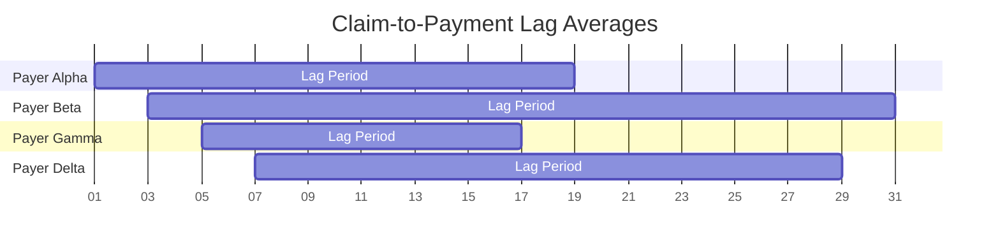
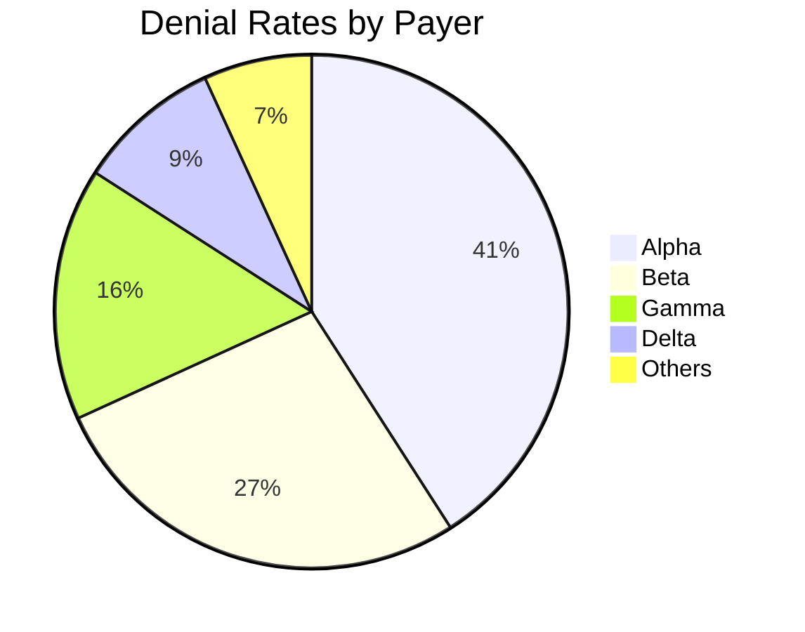
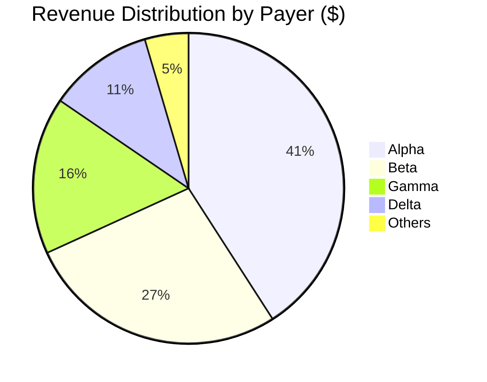

# QMTRY-Audit-Ready-Billing-Analytics-Automation-Suite-
Audit-ready AWS billing automation with AI-powered variance explanations, Athena analytics, and QuickSight dashboards — deployable via CDK.

[](https://github.com/daniel-QMTRY/QMTRY-Audit-Ready-Billing-Analytics-Automation-Suite/actions/workflows/build.yml)
[](https://github.com/daniel-QMTRY/QMTRY-Audit-Ready-Billing-Analytics-Automation-Suite/actions/workflows/cdk-deploy.yml)
[](https://aws.amazon.com/solutions/)
[](https://aws.amazon.com/bedrock/)
[](https://www.hhs.gov/hipaa/index.html)
[](LICENSE)


Welcome to the ultimate AWS-powered toolkit for conquering the wild world of healthcare claims, payments, denials, and reconciliations. Designed for payers, providers, and federal health IT warriors, QMTRY isn't just software—it's your secret weapon for turning billing chaos into streamlined, provable success.  

We don't merely crunch numbers; we dissect them, explain them, and arm you with dashboards that make executives lean in and auditors nod in approval. Dive in, deploy, and watch your revenue cycle transform from headache to high-five.

---

## ✨ Standout Features That Deliver Real Impact

- ⚡ **Seamless Payment & Billing Automation** — Harness Step Functions, SQS, and DynamoDB for pipelines that handle surges like a pro, ensuring every claim flows without a hitch.  
- 🛡️ **Ironclad Compliance from the Ground Up** — KMS encryption, immutable object locks, least-privilege IAM roles, and HIPAA-aligned architecture to keep you audit-ready and worry-free.  
- 📊 **Advanced Analytics Engine** — Glue, Athena, and QuickSight unite for effortless, one-click dashboards that reveal hidden trends in real-time.  
- 🤖 **Bedrock Variance Explainer Agent** — Powered by AI, it generates daily narratives pinpointing why payments fell short, complete with contract citations and actionable insights.  
- 📬 **Executive-Grade Exports** — Wake up to fresh CSVs in S3, packed with denial rates, payment lags, and payer breakdowns—ready for your morning briefing.  
- 🔔 **Proactive Monitoring & Alerts** — CloudWatch and SNS keep watch, firing off notifications the instant queues lag or dead-letter queues stir, so issues get squashed before they escalate.

---

## 🏗️ Architecture: A Symphony of Efficiency

At the heart of QMTRY is a robust, scalable AWS reference architecture that orchestrates data from intake to insight. Here's the big picture:

```mermaid
flowchart TD
    A[API Gateway / S3 Ingress Zone] --> B[Step Functions Maestro]
    B --> C1[Schema Validator Lambda (JSON Schema Enforcement)]
    C1 --> C2[Adjudication Lambda (Aurora Fee Schedule Integration)]
    C2 --> Q[SQS Reconciliation Buffer]
    Q --> P[Persistence Lambda → DynamoDB Vault]
    P -->|Audit Trails| S3[Secure S3 Layers: Raw / Curated / Gold / Evidence Archives]
    S3 --> G[Glue ETL + Athena Query Engine]
    G --> QSight[QuickSight Visualization Hub]
    S3 --> V[Bedrock Variance AI Agent]
    V --> R[Automated Executive Narratives & Reports]
    QSight -->|Interactive Insights| X[Executive Dashboards & Auditor Portals]
    style A fill:#f9f,stroke:#333
    style S3 fill:#ff9,stroke:#333
    style QSight fill:#9ff,stroke:#333
    style V fill:#f99,stroke:#333
```

### 📈 Sample Executive Visuals: See the Story Unfold

**Payment Lag Trends** – Track how long it takes from claim to cash.



**Denial Rate Breakdown** – Spot the culprits at a glance.



**Payer Revenue Mix** – Visualize where the dollars are flowing.



### 🧩 Key Building Blocks: The Magic Under the Hood

- **Data Integrity Enforcer** → JSON Schema validation via Ajv to snag invalid claims right at the door, preventing downstream disasters.  
- **Smart Rate Lookups** → Pull procedure codes and pricing from Aurora-stored fee schedules for lightning-fast, accurate adjudication.  
- **Resilient Queuing** → SQS handles traffic spikes with idempotency checks, shielding DynamoDB from overload.  
- **Fail-Safe Mechanisms** → Dead-letter queues capture stragglers, while CloudWatch alarms trigger SNS alerts for immediate intervention.  
- **Analytics Powerhouse** → Glue crawlers feed Athena workgroups (e.g., qmtry-billing-wg), fueling curated QuickSight datasets.  
- **IaC for Insights** → CDK deploys QuickSight datasets and dashboards seamlessly, integrating your templates and data sources.  
- **AI Narrative Wizard** → Bedrock's Claude 3.5 Sonnet analyzes remits against contracts, crafting variance reports that read like a detective novel—complete with clues and resolutions.

---

## 🧪 Quick Launch: From Zero to Operational in Minutes

Get QMTRY up and running with these straightforward steps. We've made deployment as smooth as silk.

1. **Clone the Repo**  
   ```bash
   git clone https://github.com/daniel-QMTRY/qmtry-billing-suite.git
   cd qmtry-billing-suite
   ```

2. **Set Up CDK**  
   ```bash
   npm install -g aws-cdk
   npm install
   npx cdk bootstrap
   ```

3. **Deploy the Core Pipeline**  
   ```bash
   npx cdk deploy CoreDataStack ComputeStack
   ```

4. **Add Analytics Layer**  
   ```bash
   npx cdk deploy AnalyticsStack
   ```

5. **Activate Reporting & AI**  
   ```bash
   npx cdk deploy ReportingStack
   ```

6. **Integrate QuickSight**  
   ```bash
   npx cdk deploy QuickSightStack
   ```

Pro Tip: Customize with your AWS account details and watch the magic unfold. Full deployment typically takes under 30 minutes on a fresh environment.

---

## 📬 What You Get Every Day: Actionable Outputs

- **Comprehensive Audit Bundles in S3** → Layered artifacts from raw inputs to gold-standard outputs, including logs, schemas, dashboards, and AI-generated narratives—all immutable and ready for scrutiny.  
- **CSV Exports for Decision-Makers** → Daily drops covering claim lag histograms, denial trends by payer, and revenue mix breakdowns.  
- **Variance Narratives in Markdown** → Engaging, story-like reports with:  
  - **TL;DR Highlights** for busy execs.  
  - **Top Variance Culprits** (payers, codes, contract clauses, and dollar impacts).  
  - **Emerging Watchlist** for potential issues.  
  - **Next Steps Checklist** to drive resolutions.

---

## 🛡️ Security & Compliance: Fort Knox for Your Data

- **End-to-End Encryption** → KMS customer-managed keys and TLS enforce protection at rest and in transit.  
- **Minimal Access Controls** → IAM policies locked down to least privilege, minimizing risks.  
- **Immutable Records** → S3 Object Lock ensures audit evidence can't be altered.  
- **Full Auditability** → CloudTrail and Config capture every action for complete traceability.  
- **HIPAA Harmony** → Built on proven patterns to meet healthcare's stringent standards.

---

## 🧠 The QMTRY Edge: Beyond Black-Box Billing

In a sea of opaque systems that spit out data without context, QMTRY shines by making every transaction explainable and every insight executable. Auditors receive contract-backed evidence; executives get intuitive visuals that spark strategy; compliance teams enjoy peace of mind with locked-down bundles; and ops folks stay ahead with preemptive alerts. It's not just automation—it's intelligence that pays dividends.

## 🤝 Tailored for Trailblazers

- **Providers** battling denials and underpayments.  
- **Payers** aiming for CMS Stars and flawless compliance.  
- **Agencies** seeking transparent, reliable partners in health IT.

## 📞 Ready to Elevate Your Game?

Drop us a line at 💌 contracts@qmtry.ai  
Explore more at 🌐 https://qmtry.ai  

This isn't just a repository—it's your launchpad to a future where billing is brilliant, audits are effortless, and every penny tells a story. Deploy QMTRY today and redefine what's possible in healthcare finance. 🚀

``
